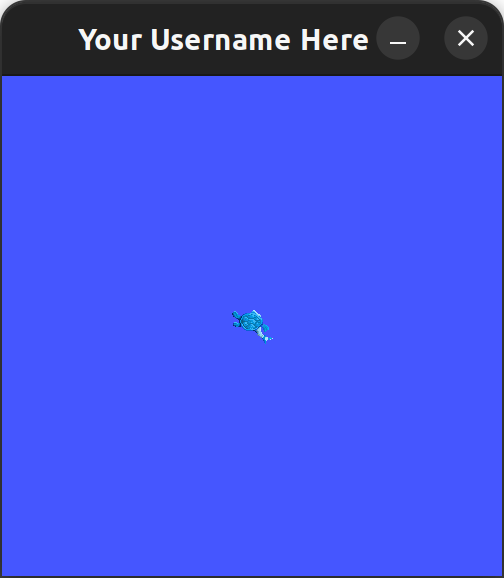

# TR-Autonomy-0.5

This is an assignment meant to give you a highly structured introduction to some of the ros2 concepts needed for the upcoming training-1 assignment

## Part 1 | Workspaces

1. Follow [this tutorial](https://docs.ros.org/en/humble/Tutorials/Beginner-Client-Libraries/Creating-A-Workspace/Creating-A-Workspace.html)
2. [Screenshot](https://help.ubuntu.com/stable/ubuntu-help/screen-shot-record.html) the modified turtlesim window you get at the end of the tutorial. Change the window title to say your GitHub username:

> 

3. Commit the screenshot to this repo.

- To do this, you will need to install git on your Ubuntu machine and set up authentication with a SSH key
  - [using SSH Keys to authenticate](https://docs.github.com/en/authentication/connecting-to-github-with-ssh/generating-a-new-ssh-key-and-adding-it-to-the-ssh-agent)

## Part 2 | Packages

1. Follow the [next tutorial](https://docs.ros.org/en/humble/Tutorials/Beginner-Client-Libraries/Creating-Your-First-ROS2-Package.html) in the sequence
2. running your new package will output `hello world my_package package`. Change this to output `hello world [your github username]!`
3. upload a screenshot of your modified output to this repo

## Part 3 | Publishers and Subscribers

1. Follow the [next tutorial](https://docs.ros.org/en/humble/Tutorials/Beginner-Client-Libraries/Writing-A-Simple-Cpp-Publisher-And-Subscriber.html) in the sequence
2. upload a screenshot of the publisher node terminal and the subscription node terminal running side by side
